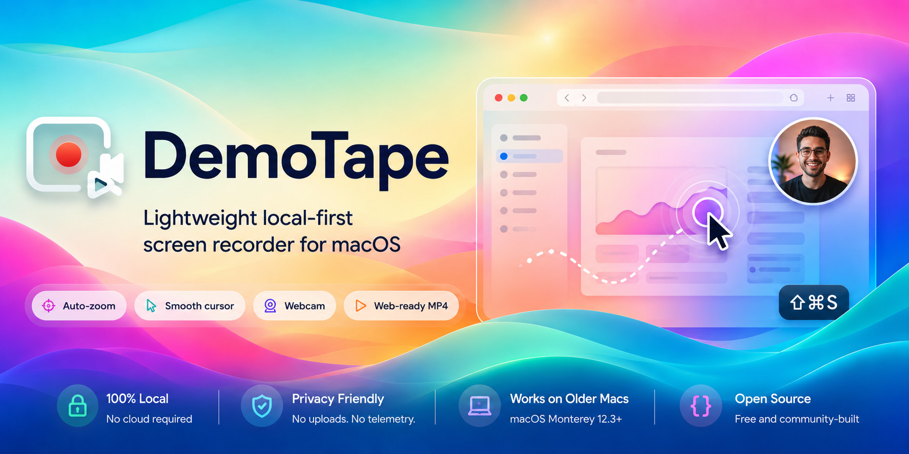

<p align="center">
  
</p>

# DemoTape

Record your screen and DemoTape turns it into a polished product demo — automatic zoom on
your clicks, a smooth cursor, a webcam bubble, captions, voiceover, even an AI presenter.
It lives in your menu bar, runs fully on your Mac, and needs no account.

Works on **macOS 12.3+** (Intel or Apple Silicon). A native **Windows 11** port is in the
[`windows/`](windows/) folder — see [DemoTape on Windows](#demotape-on-windows). Free and open source.

---

## Get DemoTape

**Easiest — let your coding agent set it up.** Clone the repo, open it in Claude Code / Codex /
Kiro, and say:

> Set up and install DemoTape by following the "Agent-assisted setup" runbook in AGENTS.md.

It builds and installs a version matched to your Mac, then tells you the one thing only you can
do: grant Screen Recording permission.

**Or download the app.** Grab `DemoTape-<version>.dmg` from
[Releases](https://github.com/gabosarmiento/demotape/releases/latest) and drag it into
**Applications**. First launch is blocked by macOS (the app isn't notarized) — right-click
**DemoTape.app → Open → Open**, or run:

```bash
xattr -dr com.apple.quarantine /Applications/DemoTape.app
```

> Run DemoTape from **/Applications** so macOS remembers your Screen Recording permission.

**First launch:** the first time you record, macOS asks for **Screen Recording** — turn DemoTape
on, then quit and reopen. Microphone, Camera, and Accessibility are only requested if you use
those features.

---

## Record

Click the menu-bar icon (or press **⇧⌘S**) and pick how you want to capture:

- **Full Screen** or **Select Recording Area** — drag out an area; it stays on screen as a frame
  you can move and resize, and never shows up in the video.
- A floating **recorder bar** appears with Start/Stop, a timer, and toggles for:
  - **Microphone** — your narration.
  - **Webcam** — a draggable, resizable circular bubble.
  - **Background** — frame the recording on a gradient or your own image.
  - **Branding** — drop your logo on top.
  - **Teleprompter** — scroll a script beside the recording so you can read while you record.

A **3-2-1 countdown** gives you a beat to get ready. When you press Stop, DemoTape auto-edits a
polished video (smooth zoom, clean cursor, shortcut badges) and saves it to
`~/Movies/DemoTape/`.

---

## Polish it

Everything after recording lives under **After Recording** in the menu. Each one opens a simple
window: your **source** video on the left, the **result** on the right. Tweak the settings, click
**Generate preview**, watch the result, and the finished file is saved with a **Reveal in Finder**
link. Every window has a **Change…** button if you want to work on a different clip.

### ✂️ Auto Cut and Speed
Trims silent gaps and can speed the clip up while keeping your voice natural. Great for making a
demo feel tight and snappy. Fully local.

### 💬 Captions
Transcribes your narration automatically, shows the lines with their timestamps so you can fix
any wording, then burns them into the video. Pick the language in its tab. (Transcribed once and
remembered, so re-opening never costs you again.)

### 🎙️ Voiceover
Turn a script into narration with an [ElevenLabs](https://elevenlabs.io) voice. The script
pre-fills from your captions, you can **preview any voice with one click**, and the narration is
laid over the video. Best for screen-only demos.

### 🧑 Avatar Presenter
Turn your voiceover into a photorealistic presenter that lip-syncs to it and sits in your webcam
bubble. Upload a **photo** or pick a library avatar. Because it's rendered in the cloud by
[HeyGen](https://heygen.com) and costs credits, DemoTape shows a clear **cost estimate and asks
you to confirm** first. Best for short clips.

### 🎬 Apply Template
Re-edit the video with a paced "look" — Clean, Keynote, Commercial, and more — for intros,
transitions, and rhythm.

### 🌐 Web Publish
Export lightweight, fast-loading MP4s for the web, plus a poster, a responsive `<video>` snippet,
and an optional animated GIF for your README.

---

## Where your files go

Everything lands next to your recording in `~/Movies/DemoTape/`:

| File | What it is |
|---|---|
| `…styled.mp4` | Your auto-edited recording |
| `…tight.mp4` | Silence-cut / sped-up version |
| `…captioned.mp4` | With captions burned in |
| `…voiceover.mp4` | With AI narration |
| `…avatar.mp4` | With the AI presenter in the webcam bubble |
| `…-web/` | Web-ready MP4s + poster + embed snippet |

Change where recordings are saved from **Recording Folder → Change Output Directory…**.

---

## AI features are optional and private

DemoTape is **local by default**. Captions, Voiceover, and Avatar are **opt-in** and use **your
own API keys** (stored in the macOS Keychain, never on disk). Turn them on in
**AI Features → AI Settings…**, where you can paste and test each key.

When AI is off, DemoTape makes **no network calls at all**. When it's on, only what a step needs
is sent to the provider you chose — captions send the audio, voiceover sends the script, the
avatar sends the narration (and your photo, if you upload one). **Your screen recording is never
uploaded.**

---

## Build from source

```bash
./create-identity.sh    # one-time: stable signing identity (keeps permissions across rebuilds)
./build-app.sh release  # build, sign, install to /Applications
open /Applications/DemoTape.app
```

No Xcode project and no third-party dependencies — just Apple frameworks and `swift build`.
Contributors and AI agents: see [`AGENTS.md`](AGENTS.md) for build/verify steps and constraints.

> `swift build` fails with `no such module 'PackageDescription'`? Your Command Line Tools are
> corrupted (common after a macOS upgrade). Reinstall with `xcode-select --install`, or install
> full Xcode and run `sudo xcode-select -s /Applications/Xcode.app`.

---

## DemoTape on Windows

There's a native **Windows 11** port in [`windows/`](windows/), built with **C# · .NET 8 ·
WinUI 3 · Windows App SDK** — same idea (record → auto-styled demo → lightweight web MP4s),
local-first, no accounts.

It mirrors the macOS features: capture + auto-styled render, region/background framing, webcam
PiP, captions, voiceover, avatar presenter, noise suppression, enhance voice, auto-cut, web
publish, teleprompter, and branding. The business logic (Domain / Services / ViewModels) is
pure `.NET` and unit-tested; only the app shell needs the Windows toolchain.

```powershell
cd windows
dotnet test tests/DemoTape.Tests/DemoTape.Tests.csproj -c Release   # logic (only the .NET 8 SDK)
dotnet run --project src/App/DemoTape.App.csproj -c Release         # full app (Windows App SDK)
```

Details and docs: [`windows/README.md`](windows/README.md) · [feature parity](windows/docs/FEATURE-PARITY.md)
· [build](windows/docs/BUILD.md) · [user guide](windows/docs/USER-GUIDE.md).

> The Windows port is catching up to the macOS app; the newest AI‑director work lands there next.

---

## License

MIT — see [LICENSE](LICENSE). Built by studying (not copying) several excellent open-source
screen recorders; DemoTape is its own dependency-free implementation.
