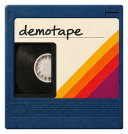
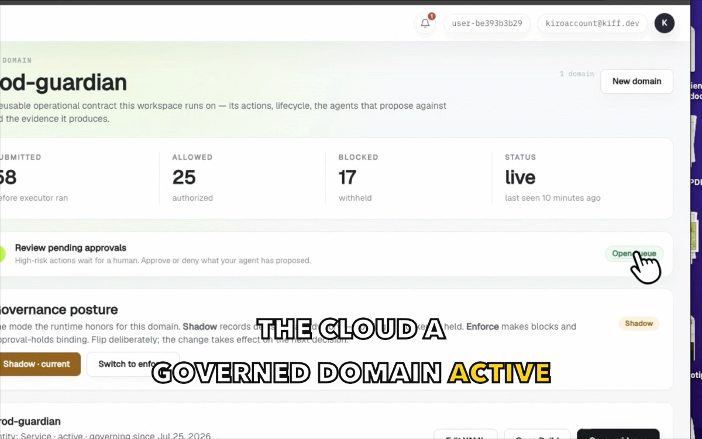

<div align="center">



# DemoTape

**The visual proof-of-work layer for coding agents.**

Your coding agent says it works. DemoTape runs the branch, performs the expected flow,
verifies what appears on screen, and produces a narrated video that proves the result.

[](https://github.com/gabosarmiento/demotape/releases/latest)
[](https://github.com/gabosarmiento/demotape/releases/latest)
[](LICENSE)
[](https://github.com/gabosarmiento/demotape)

</div>

Runs on **macOS 12.3+** (Intel or Apple Silicon) — including older Macs like Monterey 12.7.6.
Local-first, no account, free and open source.

> Free forever — no account, no license, no upsell. If it saved you time,
> [**★ star the repo**](https://github.com/gabosarmiento/demotape).

---

## The problem

A coding agent can edit files, run commands, pass a test suite, and report that it's done. None of
that answers the question a reviewer actually has: **does the product visibly behave as promised?**

> Code diffs show what changed. Tests show what a machine asserted.
> DemoTape shows the delivered product behaving correctly.

Screenshots go stale and prove nothing about a flow. "Works on my machine" isn't a review artifact.
And a recording that was edited until it looked good is marketing, not evidence.

## How it works

```
task or acceptance criteria
        ↓
run the actual branch          launch the real app, locally
        ↓
perform the user journey       drive the UI the way a user would
        ↓
record the screen              styled, narrated, synced to each action
        ↓
verify the expected scenes     compare what was claimed against what is on screen
        ↓
publish video + evidence       a video to watch, verdicts to check
```

The load-bearing rule: **a failed scene stays visible.** A take that shows the wrong thing fails
loudly and reports why — it is never quietly trimmed out to make the video look clean.

Two independent checks run, and they answer different questions:

| Check | What it is | What it catches |
|---|---|---|
| **Assertions** | Deterministic post-conditions you declare per scene (`urlContains`, `visible`, `value`) | A click that didn't land, an input that didn't take, a page that never arrived |
| **Scene verification** | A vision model compares each scene's settled frame against its narration line | The flow "worked" but showed an error, a blank state, or the wrong screen |

Verification is honest about its own failure mode. There are **three** outcomes, not two:

| Outcome | Exit | Meaning |
|---|---|---|
| `verified` | 0 | assertions and scene verification both passed |
| `unverified` | 2 | something genuinely contradicts the script — fix it |
| `inconclusive` | 3 | assertions passed but the vision gate could not run (e.g. provider rate limit) — review by hand |

An `inconclusive` result is never presented as a pass.

## Visual evaluations

The video is not decoration. It is the eval result, in a form a human can absorb in two minutes.

Each run produces two kinds of evidence:

**Human-readable** — a concise narrated walkthrough (`…voiceover.mp4`), with the narration leading
each action so the words point at what's happening. Optionally captioned, tightened, re-voiced in
another language, or reframed for vertical.

**Machine-readable** — `demo-report.json` beside the video, containing:

- the overall verdict (`ok`, `assertionsOk`, `verifyOk`)
- per-scene assertion results (scene index, pass/fail, reason)
- per-scene verification verdicts with **timestamps**, the reason the model gave, and the narration
  line each frame was judged against
- the path of the artifact the verdicts describe

Alongside it: `verify-scenes.json` (the exact moments the gate photographed, so a gate that couldn't
run can be re-run on the same frames), `timeline.json` (scene offsets and lines, so narration can be
re-voiced without re-recording), and `recipe.json` (every styling decision, so the video can be
re-derived from the raw take).

> **Planned, not yet implemented:** a single consolidated evaluation manifest (working name
> `eval.json`) carrying **source branch, source commit, and expected-vs-observed state** as
> structured fields. Today's `demo-report.json` records verdicts, timestamps, reasons and narration
> lines, but it does **not** capture git metadata. See [Roadmap](#roadmap).

## Example

**Agent claim**

> "Bulk CSV and PDF export is implemented and ready for review."

**Expected scenes**

1. Select 200 report rows.
2. Export the selected rows as CSV.
3. Export the selected rows as PDF.
4. Verify the generated files contain the expected data.

**Result**

```
SCENE 01  Select 200 report rows            PASS
SCENE 02  Export selected rows as CSV       PASS
SCENE 03  Export selected rows as PDF       PASS
SCENE 04  Files contain the expected data   PASS
```

You get a narrated recording of that flow running against the branch, plus the per-scene verdicts
that back it up. (Tying the artifact to a specific branch and commit is
[planned](#roadmap) — today you attach it yourself.)

## Who it's for

**Developers** — review behavior before reading the diff. Watch the feature run from the submitted
branch, then read the code knowing what it's supposed to do.

**QA engineers** — preserve visual evidence for acceptance criteria and regression flows. Attach a
recording with per-scene verdicts to the ticket instead of writing "passed."

**Product managers** — understand what shipped without checking out the branch or booking a demo
meeting.

**AI coding teams** — make "show your work" part of the definition of done, so an agent's completion
claim arrives with evidence attached.

---

## Current capabilities

Generated from what's in this repository today.

### Available now

**Agentic recording**
- A skill that drives the whole pipeline from a prompt: understand the app, script scenes, drive the
  browser, record, narrate, verify ([`SKILL.md`](tools/demo-driver/skill/record-verified-demo/SKILL.md))
- Headless rehearsal (`--rehearse`) — validates every step and assertion with no recording, so a
  broken take never gets recorded
- Per-scene assertions and a vision verification gate, with the three-state outcome above
- `demo-report.json`, `verify-scenes.json`, `timeline.json`, `recipe.json` written beside the video

**Recording**
- Full screen, selected area (lockable in place), or **webcam only** at 1080p
- Auto-styled render: spring-eased auto-zoom on real activity, smooth synthetic cursor, click
  ripples, keyboard-shortcut badges, framed backgrounds, webcam PiP, branding watermark
- Teleprompter that scrolls on screen but stays out of the recording
- Countdown, mic/camera toggles, audio enhancement and noise suppression

**Post-production** (all reachable headlessly)
- `--render` / `--recipe` / `--show-recipe` — re-derive the styled video from the raw take; revise
  the look from a one-key patch instead of re-recording
- `--reframe` — vertical/social cuts (9:16, 1:1, 4:5) via a planned camera that crops the sides and
  fills the height, holds shots, follows typed text, and routes long moves through an overview;
  `--debug` draws the camera rect on the landscape footage
- `--tighten` — Auto-Cut: remove silence, adjust pace
- `--captions` / `--burn` / `--srt` — transcribe, edit, burn subtitles (14 styles incl. word-by-word)
- `--tts` / `--voiceover` / `--voiceover-timeline` / `--tag` — narration, laid at scene offsets;
  `narrate` and `revoice` add a language or swap the voice from the same footage, no re-record
- `--verify` / `--frame` / `--cursor` — the verification gate, still grabs, cursor control
- `--transcode` / `--publish` / `--gif` — web tiers, poster, embed snippet, GIF

**Local and offline**
- Provider-pluggable STT and TTS: hosted, any OpenAI-compatible endpoint, or fully local
- `scripts/local-ai.sh` — one command sets up local narration and captions with **no API keys**
- Recorder, renderer and exporter make **no network calls** at all

### Experimental

- **Avatar** — a photorealistic presenter lip-synced to your voiceover. Cloud, paid, shows cost
  before running.
- **AI Director** (`--brief`, `--template`) — reasons over transcript and activity to propose an edit.
- **Windows port** ([`windows/`](windows/), C# · .NET 8 · WinUI 3) — traditional recording and the
  styled render work; the agentic, captions, voiceover and avatar features are macOS-only.

### Planned

Not implemented. Do not expect these to work yet.

- GitHub pull-request bot that attaches the video and verdicts automatically
- Jira and Linear acceptance criteria as the eval input
- CI-triggered evaluations
- Shared team evidence library
- Consolidated `eval.json` manifest with branch, commit, and expected-vs-observed state
- Managed cloud services (hosted captions/voiceover without your own key)

---

## Quick start

### 1. Install

**Requirements:** macOS 12.3+ (Intel or Apple Silicon).

**Download.** Grab `DemoTape-<version>.dmg` from
[Releases](https://github.com/gabosarmiento/demotape/releases/latest) and drag it into
**Applications**. It's Developer-ID signed and notarized, so it opens normally. Run it from
**/Applications** so macOS remembers Screen Recording permission.

**Or build from source.**

```bash
./create-identity.sh    # one-time signing identity (keeps permissions across rebuilds)
./build-app.sh release  # build, sign, install to /Applications
```

No Xcode project, no third-party dependencies — Apple frameworks and `swift build`. See
[`AGENTS.md`](AGENTS.md) for build and verify steps.

### 2. Grant permissions

**First launch** asks for **Screen Recording**: click Allow, tick DemoTape in System Settings, then
**Quit & Reopen** (macOS only applies it on relaunch). Microphone, Camera and Accessibility are
requested only when a feature needs them.

### 3. Record something (30 seconds)

Click the menu-bar icon (**⇧⌘S**), pick **Full Screen** or an area, press **Start**, do something,
press **Stop**. DemoTape writes a styled video to `~/Movies/DemoTape/`.

### 4. Set up narration and captions

These are the only features that need a model. Three options:

**Local, no API key** (needs Docker):

```bash
scripts/local-ai.sh          # pulls Kokoro + Whisper, points DemoTape at them, proves it works
scripts/local-ai.sh --status # what's running
scripts/local-ai.sh --uninstall
```

It verifies itself end to end: synthesizes a clip with the local TTS, transcribes it back with the
local STT, and prints what it heard. No key is written and the Keychain is untouched.

**Your own hosted key** — add it in **AI Settings**; it's stored in the macOS Keychain.

**Any OpenAI-compatible endpoint** — see [`tools/tts-shim`](tools/tts-shim).

### 5. Let your agent record a verified demo

Install the skill:

```bash
tools/demo-driver/skill/install.sh              # Claude Code (~/.claude/skills)
tools/demo-driver/skill/install.sh --kiro       # Kiro (this workspace)
tools/demo-driver/skill/install.sh --dir <path> # any other skills directory
```

Then, in a checkout of your app, ask your agent:

> Open the application from the current branch. Verify that a user can select multiple reports,
> export them as CSV, and export them as PDF. Record the full flow, narrate the result, and show a
> verdict for each expected scene.

Or more simply:

> Record a verified demo of &lt;feature&gt; in this app.

You get a `…voiceover.mp4` and a `demo-report.json` with a per-scene verdict. In the app it's the
first menu item: **Let Your Coding Agent Record a Demo…**

Driving the driver directly:

```bash
cd tools/demo-driver && npm install
node driver.mjs <config>.json --rehearse   # validate steps + assertions, headless, seconds
node driver.mjs <config>.json              # record, narrate, verify
node driver.mjs narrate <recording> lines-es.json   # another language, same footage
node driver.mjs revoice <recording> <voiceId>       # swap the voice, keep the sync
```

---

## See it

This demo was made by a coding agent — scripted, recorded, narrated and verified — then sped up and
captioned, all from prompts:

[](https://github.com/gabosarmiento/demotape/releases/download/v7.0.0/demotape-demo.mp4)

▶ [**Watch the 2-minute demo**](https://github.com/gabosarmiento/demotape/releases/download/v7.0.0/demotape-demo.mp4)

<!--
  To play INLINE (like DeepFilterNet's README), GitHub needs an "attachment" URL, which is only
  minted by uploading through the web UI — a release-download or raw URL will NOT render a player.
  One-time step: edit this README on github.com, drag demotape-demo.mp4 into the editor, and GitHub
  inserts a line like  https://github.com/gabosarmiento/demotape/assets/<id>/<uuid>  — replace the
  poster block above with that bare URL on its own line and the player embeds directly.
-->

A real run, start to finish, driven entirely by prompts:

1. **Understand the app.** The agent read a codebase (KIFF, an AI-governance platform), installed the
   skill, and worked out what was worth showing and how to reach it.
2. **Script and record.** It stood up the local stack, wrote the scenes, drove the browser, and
   recorded — narration synced to each action.
3. **Verify.** Every scene was checked against what was actually on screen; a take that showed the
   wrong thing fails loudly instead of shipping.
4. **Polish, by prompt.** Sped up to 1.25×, captions burned in, then the whole thing re-voiced in
   **Spanish** and **French** — same footage, new narration and subtitles, no re-recording.

---

## Record it yourself

Not every video is an agent run.

### Webcam only

**Webcam Only** is a first-class capture mode — pick it from the menu-bar icon or the floating bar's
**•••** — and DemoTape records just your camera at 1080p, a clean talking-head. A near-full-screen
live preview makes it obvious the camera is the whole video, and an optional teleprompter scrolls on
screen for you but **never appears in the recording** (it captures the camera, not the screen).
Mirror the image with **Mirror camera**, and clean the mic with **Enhance audio** and **Noise
suppression**. The result is a normal recording, so Captions, Voiceover and Web Publish all work on it.

The agent can write the script and run the teleprompter for you:

> Help me make a 1-minute YC application video. Write it to sound natural when spoken (per
> ycombinator.com/video), load it into the teleprompter, and tell me when to start.

It loads the teleprompter, says "ready when you are", counts 3-2-1, and records you to camera.

### Screen recording

Pick **Full Screen** or an area and a floating bar appears: Start/Stop, a timer, a blinking tally
light while rolling, mic and webcam toggles, and a **•••** for what you set before a take —
background, branding, teleprompter, auto-zoom. Pick an area and you can **lock** it in place to click
and scroll the app beneath while framing your shot.

Then, under **After Recording**, each step opens a source→result window with a **Generate preview**:

- **Auto-Cut / Auto-Edit** — trim silences and tighten pace, or re-edit with a paced look. Local.
- **Captions** — transcribe, edit the lines, burn them in. Includes word-by-word social styles.
- **Voiceover** — turn a script into narration; add another **language** on the same timings.
- **Avatar** — a photorealistic presenter that lip-syncs to your voiceover (cloud, shows cost first).
- **Web Publish** — lightweight MP4 tiers, a poster, an embed snippet, and a GIF.

Captions, Voiceover and Avatar can also hand the job to your coding agent with **Copy prompt for
your agent**.

---

## Local-first and privacy

- **Recordings stay on your Mac.** The recorder, renderer and exporter make **no network calls**.
  Your screen recording is never uploaded.
- **No account.** No sign-up, no license key, no telemetry gate.
- **AI steps are opt-in.** They only run when you turn them on, and only send what the step needs:
  captions send the audio, voiceover sends the script, verification sends the frames it judges.
- **Bring your own keys** (stored in the macOS Keychain), or run **fully local** models with
  `scripts/local-ai.sh` — no key, nothing leaving the machine.
- **MIT licensed**, so you can read exactly what it does.

The cloud **Avatar** feature is the exception: it uploads to a third-party provider by design, is
clearly marked, and shows its cost before running.

---

## DemoTape and Kiff

DemoTape works independently and needs nothing else. It also fits naturally into governed agent
workflows: [Kiff](https://kiff.dev) controls what an agent may do, while DemoTape proves what the
agent delivered.

> **Kiff governs the work. DemoTape proves the result.**

---

## Roadmap

Planned, not implemented. Ordered roughly by how much it changes the workflow.

1. **Reusable visual-evaluation specs** — save a verified flow as a named eval and re-run it against
   any branch, so a demo becomes a regression check.
2. **CI and pull-request execution** — run an eval on a branch and attach the video plus verdicts to
   the PR automatically.
3. **Jira and Linear acceptance criteria as input** — point at a ticket; its criteria become the
   expected scenes.
4. **Structured evaluation manifests** — a consolidated `eval.json` with source branch, commit, and
   expected-vs-observed state per scene.
5. **Shared evidence libraries** — a team-wide history of runs with their verdicts.
6. **Policy-based completion requirements** — an agent's work isn't "done" until its evals pass.
7. **Expected-vs-observed visual diffing** — compare this run's frames against the last known-good run.

---

## Contributing

Bug reports and pull requests welcome. Start with [`AGENTS.md`](AGENTS.md) — it covers the build,
the hard constraints (macOS 12.3 target, Apple frameworks only, no third-party dependencies,
local-by-default), the headless hooks for verifying render changes without granting Screen Recording,
and troubleshooting.

```bash
swift build -c release   # compile
swift test              # 408 tests: pure logic, no GUI, no network
```

## License

MIT — see [LICENSE](LICENSE). A dependency-free implementation of its own; built by studying, not
copying, other open-source recorders.
